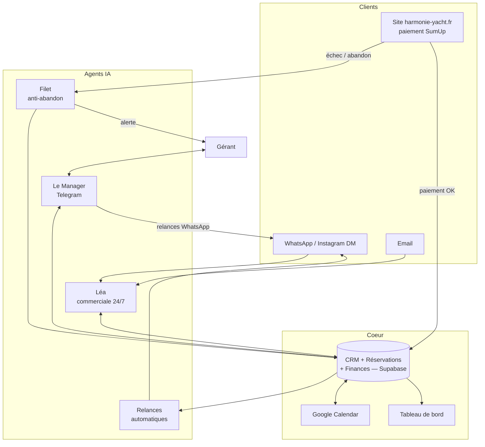

# L'infra IA d'Harmonie Yacht — expliquée simplement

> Un bateau, un gérant, et une équipe d'employés IA qui travaillent 24h/24.
> Ce document est la référence pour présenter le système (réseaux sociaux,
> vidéos, partenaires) : chaque agent a un nom, un métier, et un rôle précis.

## L'histoire en une phrase

Un client envoie un message WhatsApp à 23h → il reçoit une réponse en moins
d'une minute → il est qualifié, sa date est vérifiée sur le vrai planning,
il paie son acompte sur le site → le CRM, l'agenda et la comptabilité se
mettent à jour tout seuls → le gérant, lui, dormait.

## L'équipe (chaque agent = un employé virtuel)

### 🧑‍💼 Léa — commerciale 24/7 (WhatsApp, Instagram, email)
Le premier contact de tous les prospects. Elle :
- répond en langage naturel, avec le ton réel de la maison (court, chaleureux, sans blabla) ;
- qualifie : date souhaitée, nombre de personnes, occasion (EVJF, anniversaire, demande en mariage…) ;
- vérifie la **vraie** disponibilité du bateau (base de réservations + Google Calendar) avant d'annoncer quoi que ce soit ;
- envoie le lien de réservation officiel au bon moment — elle ne prend jamais l'argent elle-même ;
- passe la main à l'humain dès qu'un cas est sensible (négociation, PMR, météo douteuse…), silencieusement.
Chaque info collectée alimente la fiche prospect en temps réel, avec un score de chaleur 0-10.

### 📲 Le Manager — l'associé de poche (Telegram)
Réservé au gérant. On lui parle comme à un associé :
- « Combien de CA ce mois-ci ? » → chiffres réels, encaissés, datés correctement ;
- « Qui était intéressé cette semaine ? » → noms + téléphones des prospects chauds ;
- « Relance Sarah en lui disant que la météo est superbe samedi » → il rédige et envoie le WhatsApp ;
- « Combien en gasoil ce mois ? » / « la pub est rentable ? » → dépenses par catégorie, ROI publicitaire ;
- il peut même modifier la configuration de Léa (offres, prix, règles) — avec confirmation obligatoire.

### 🔁 Les relances automatiques
Un prospect qui ne répond plus n'est pas perdu : il est relancé
automatiquement, au bon moment, avec un message contextuel — pas un
template froid.

### 🕸️ Le filet anti-panier-abandonné
Quand quelqu'un remplit le formulaire de réservation du site mais échoue ou
abandonne au moment de payer : ses coordonnées sont déjà capturées, une
fiche prospect « chaude » est créée (score 8/10), et le gérant reçoit une
alerte email + WhatsApp pour le rattraper pendant qu'il est encore chaud.
**Plus aucune tentative de réservation n'est perdue.**

### 📅 La synchro Google Calendar (dans les deux sens)
- Une réservation créée dans le CRM apparaît dans l'agenda partagé de l'équipage.
- Une réservation notée à la main dans l'agenda est importée dans le CRM
  (client créé, réservation créée, finances mises à jour).
Le planning n'a qu'une seule vérité, où qu'on le regarde.

### 💶 La comptabilité qui s'écrit toute seule
Chaque encaissement se range automatiquement à la bonne date :
- l'**acompte** compte pour le jour où le client l'a payé ;
- le **solde** compte pour le jour de la sortie ;
- une annulation retire proprement l'argent des comptes.
Résultat : le CA du mois affiché est le vrai, sans pointage manuel.

### 🖥️ Le tableau de bord (le poste de pilotage)
Une web-app privée où tout converge :
- **Prospects** : kanban du pipeline (nouveau → contacté → qualifié → devis → réservé) ;
- **Réservations** : fiches complètes, encaissements multi-moyens, contrats ;
- **Finances** : CA, dépenses par catégorie, résultat net, transactions ;
- **Résultats** : demandes traitées, messages envoyés, CA généré, crédits IA consommés.

## Le schéma

## La stack (pour ceux qui demandent)

| Brique | Rôle |
|---|---|
| Claude (Anthropic) | le cerveau de tous les agents |
| Supabase | base de données + fonctions serverless + crons |
| Next.js / Vercel | le tableau de bord |
| WhatsApp + Telegram + Resend | les canaux (clients et gérant) |
| Google Calendar | le planning partagé de l'équipage |
| SumUp | l'encaissement en ligne |

## Idées de série pour les réseaux (5 épisodes)

1. **« Mon yacht se vend tout seul pendant que je dors »** — screen-record
   d'une vraie conversation Léa de nuit, réveil avec l'acompte encaissé.
2. **« Mon associé est un bot Telegram »** — marcher sur le port en
   demandant le CA du mois et en faisant relancer un prospect à la voix.
3. **« Plus aucun panier abandonné »** — un paiement qui échoue → l'alerte
   qui arrive → le client rattrapé en 5 minutes.
4. **« Ma compta se fait toute seule »** — encaisser un solde le jour de la
   sortie et montrer les Finances qui se mettent à jour seules.
5. **« Comment tout est branché »** — l'épisode "cerveau" avec le schéma
   ci-dessus, pour l'audience entrepreneurs.

> Conseil de diffusion : les épisodes 1-4 parlent aussi aux clients
> (réassurance : réponse immédiate, sérieux, planning fiable). L'épisode 5
> parle aux entrepreneurs — c'est celui qui se recycle en contenu B2B.
